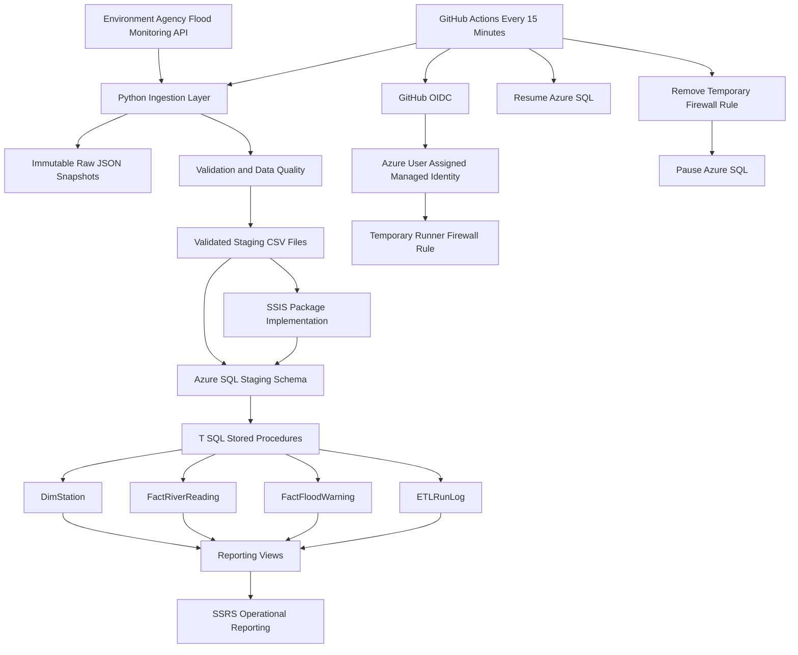

# Platform Architecture

## Overview

The Greater Manchester Flood & River Monitoring ETL & Reporting Platform collects near real time Environment Agency monitoring data, validates source records, loads analytical data into Azure SQL, and prepares the warehouse for operational reporting through SSIS and SSRS.

## Architecture

